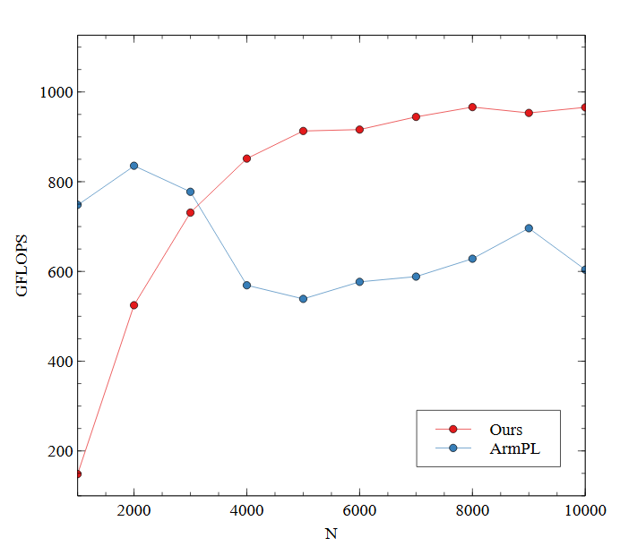

# Auto-tuned GEMM kernels for Marvell ThunderX2 Processors

Auto-tuned Double-precision General Matrix-Matrix Multiplication kernels for Marvell ThunderX2 CN9980.

# Requirements

- [GNU Make](https://www.gnu.org/software/make)
- [Arm Compiler](https://developer.arm.com/documentation/ka005198/latest)
- [Arm Performance Libraries](https://developer.arm.com/Tools%20and%20Software/Arm%20Performance%20Libraries)
- [NUMA](https://github.com/numactl/numactl)

# Build

To build executables, run `make all`.  
The executables can be used to benchmark our kernels.

To build shared objects, run `make shared`.  
The shared objects can be used to benchmark our kernels or can be loaded from other applications.

# Run Benchmark

The easiest way to benchmark our kernels is running `run.sh` on shell.  
`run.sh` runs benchmark using following parameters and repeats 5 times:
```
Number of threads: 64
Layout: Row-major
TransA: No
TransB: No
M, N, K: 10000
Alpha: 1.0
Beta: 1.0
```

Instead, you can run benchmark by directly running the executable.  
```
Usage: ./out/[name].out NumThreads Layout(Row/Col) TransA(T/N) TransB(T/N) M N K alpha beta iter
```
For example, `./out/kernel.latest.out 64 Row N N 6000 6000 6000 1.0 1.0 10`.

You can also benchmark the shared library using [benchmark-dgemm](https://github.com/lshqqytiger/benchmark-dgemm).

# Performance

## Single-core

TBA

## Multi-core


